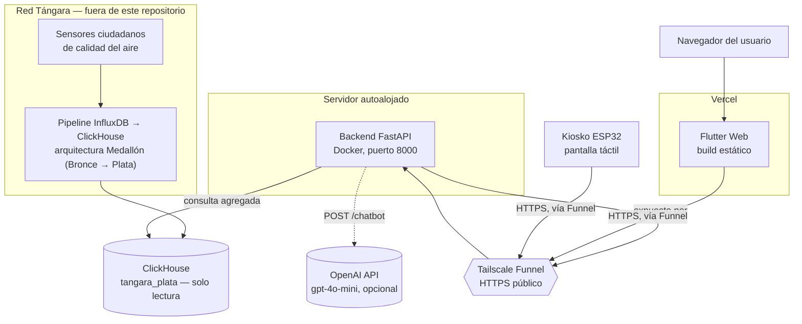
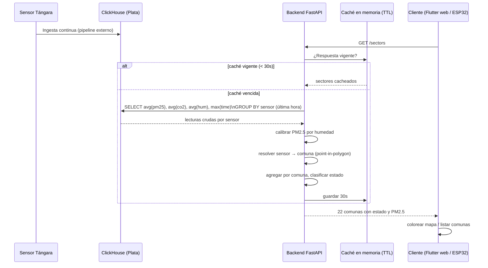

# Arquitectura

EcoBytes es una plataforma de monitoreo de calidad del aire para Cali, Colombia. Reutiliza los datos ya recolectados por la red de sensores ciudadanos Tángara para ofrecer tres formas de acceso: un mapa web por comuna, un asistente conversacional sobre esos mismos datos, y un kiosko físico con pantalla táctil que replica el flujo esencial sin necesidad de un navegador.

El sistema no recolecta datos propios ni mantiene una base de datos propia de sensores. Toda la telemetría proviene de la capa Plata del pipeline de datos de Tángara (ClickHouse), a la que el backend accede en modo exclusivamente lectura.

## Componentes

**Backend (`Backend/`)** — Servicio FastAPI sin estado propio. Expone seis endpoints HTTP, consulta ClickHouse bajo demanda, aplica calibración y clasificación sobre las lecturas crudas, y cachea las respuestas agregadas en memoria durante ventanas cortas. Es el único componente que habla con ClickHouse y con OpenAI. Ver [`backend.md`](./backend.md).

**Frontend (`Frontend/ecobytes/`)** — Aplicación Flutter compilada exclusivamente a web. Landing de presentación, mapa interactivo de las 22 comunas, detalle histórico por comuna, contenido educativo y un chatbot ambiental. Consume el backend por HTTP y no tiene lógica de agregación propia: todo el cálculo de estado (verde/amarillo/rojo/gris) llega ya resuelto desde el servidor. Ver [`frontend.md`](./frontend.md).

**Firmware del kiosko (`Firmware/esp32-kiosko/`)** — Cliente HTTP embebido sobre un ESP32 con pantalla táctil, que consume un subconjunto de los mismos endpoints (`/sectors`, `/sectors/{id}`, `/risk/{sector}`) para replicar el flujo landing → detalle de comuna en un punto de consulta físico, sin depender de un navegador ni de una app instalada. Ver [`firmware-esp32-kiosko.md`](./firmware-esp32-kiosko.md).

**ClickHouse (externo)** — La capa Plata del pipeline de Tángara (`tangara_plata.plata_tangara_sensores`), mantenida fuera de este repositorio. EcoBytes no participa en la ingesta: solo consulta.

**OpenAI (externo, opcional)** — Modelo de lenguaje que redacta las respuestas del asistente ambiental a partir de datos reales ya calculados por el backend. El modelo no decide qué cifras existen; solo las explica. Si no hay credencial configurada, el resto de la plataforma sigue funcionando y únicamente el chatbot queda desactivado.

## Diagrama de componentes y despliegue

La topología de despliegue vigente:

- El **backend corre autoalojado**, orquestado con Docker (ver `backend.md` §Docker Compose), escuchando en el puerto 8000 de un servidor que forma parte de una tailnet de Tailscale.
- Ese puerto se publica a internet como una URL HTTPS pública mediante **Tailscale Funnel**, sin necesidad de abrir puertos en el router ni de gestionar certificados TLS manualmente. Es la única vía por la que el frontend y el kiosko alcanzan al backend en producción.
- El **frontend se despliega en Vercel** como build estático (`flutter build web`). Vercel ejecuta su propio script de build (`scripts/vercel-build.sh`), que instala el SDK de Flutter y compila apuntando a la URL de Funnel del backend, inyectada como variable de entorno de build.
- El **kiosko ESP32** es un tercer cliente HTTP del mismo backend, independiente del frontend Flutter: no pasa por Vercel ni comparte código con él, solo consume el contrato de datos.

## Flujo de datos de extremo a extremo

Cada lectura de un sensor recorre esta cadena antes de llegar a una pantalla:

1. **Ingesta.** El pipeline de Tángara escribe en InfluxDB y lo propaga a ClickHouse en dos capas: Bronce (cruda) y Plata (normalizada). EcoBytes solo lee de Plata.
2. **Calibración.** El backend corrige el sesgo por humedad de los sensores ópticos de bajo costo (los sensores PMS5003/PMS7003 sobrestiman PM2.5 en ambientes húmedos) antes de que el valor salga de `services/clickhouse_client.py`. Ningún router ni cliente ve jamás el PM2.5 sin calibrar.
3. **Resolución geográfica.** Cada sensor se ubica por su geohash y se asigna a una de las 22 comunas de Cali mediante point-in-polygon sobre un GeoJSON oficial (IDESC), sin depender de un catálogo administrativo sensor→comuna que no existe en el pipeline de origen.
4. **Agregación y clasificación.** Los sensores de una misma comuna se promedian y el resultado se clasifica en verde, amarillo, rojo o gris según los umbrales de la OMS para PM2.5 (24h): bueno &lt;15 µg/m³, moderado 15–35, dañino &gt;35. El estado gris indica ausencia de dato confiable — nunca "aire limpio".
5. **Caché.** Las respuestas agregadas se cachean en memoria con TTL corto (30 segundos para el mapa, una hora para el mapeo sensor→comuna) para absorber el sondeo periódico del frontend sin golpear ClickHouse en cada petición.
6. **Entrega.** El backend responde en JSON a cualquiera de sus clientes — el mapa Flutter, el detalle de comuna, el kiosko o las herramientas del chatbot — que consumen exactamente los mismos números, calculados una sola vez.

## Decisiones de diseño vigentes

**Backend sin estado propio.** El único almacenamiento que posee este repositorio es un archivo GeoJSON estático (los polígonos de las 22 comunas). Toda la serie de tiempo de sensores vive en ClickHouse, fuera del control de EcoBytes; el backend es una capa de consulta y presentación, no un sistema de almacenamiento nuevo. Esto simplifica el despliegue (no hay migraciones, no hay backups propios de datos de sensores) y evita duplicar una fuente de verdad que el pipeline de Tángara ya mantiene.

**Contrato de API cerrado a seis endpoints.** `GET /sectors`, `GET /sectors/{id}`, `GET /sectors/{id}/sensores`, `GET /risk/{sector}`, `GET /education`, `POST /chatbot`, más `/health`. Cada cliente (Flutter, ESP32) consume un subconjunto de este mismo contrato; ninguno tiene una API propia. Mantener el contrato pequeño y explícito facilita que un tercer cliente (como el kiosko) se integre sin sorpresas.

**Calibración de PM2.5 centralizada en una sola función.** La corrección por humedad se aplica una única vez, dentro del cliente de ClickHouse, para que ningún router ni consumidor pueda accidentalmente mostrar un valor crudo junto a uno calibrado.

**Point-in-polygon en memoria, sin motor GIS externo.** Con 22 polígonos fijos y una consulta que no necesita índices espaciales sofisticados, `shapely` cargado en memoria al arrancar el proceso es suficiente y evita una dependencia de infraestructura adicional (PostGIS u otro motor geoespacial).

**Caché con TTL corto en vez de invalidación activa.** El mapa se actualiza por sondeo periódico (cada 45 segundos desde el frontend), así que una caché de 30 segundos en el servidor es suficiente para amortiguar picos de tráfico sin introducir la complejidad de invalidar la caché de forma proactiva cuando llegan datos nuevos.

**CORS cerrado por defecto (fail-closed).** El backend no permite ningún origen si `CORS_ORIGINS` no está configurado explícitamente. Evita que un despliegue mal configurado quede abierto a cualquier dominio por omisión.

**Chatbot con datos reales, no generación libre.** El modelo de lenguaje nunca inventa cifras: solo redacta en lenguaje natural sobre un snapshot de datos ya calculado por el propio backend (mismo camino que `/sectors`), y puede pedir detalles adicionales de una comuna puntual mediante function calling, usando las mismas funciones de agregación que exponen los demás endpoints. La respuesta del modelo está forzada a un esquema JSON estricto para que el frontend pueda pintar botones de acción sin parsear texto libre.

**Exposición vía Tailscale Funnel en vez de un proveedor cloud gestionado.** El backend es autoalojado y se publica con Funnel, que resuelve TLS y el acceso público sin infraestructura adicional (balanceador, certificado gestionado). El frontend, por su naturaleza estática, se beneficia en cambio de un CDN gestionado (Vercel) para servir sus assets con baja latencia global.

## Documentos relacionados

- [`backend.md`](./backend.md) — stack, endpoints, modelo de datos, configuración, Docker Compose, exposición vía Tailscale Funnel.
- [`frontend.md`](./frontend.md) — stack, páginas, flujos de usuario, consumo de la API, despliegue en Vercel.
- [`firmware-esp32-kiosko.md`](./firmware-esp32-kiosko.md) — hardware, arquitectura del firmware, protocolo de comunicación, credenciales.
- [`backlog.md`](./backlog.md) — estado real de cada funcionalidad y trabajo pendiente, reconstruido desde el código.
