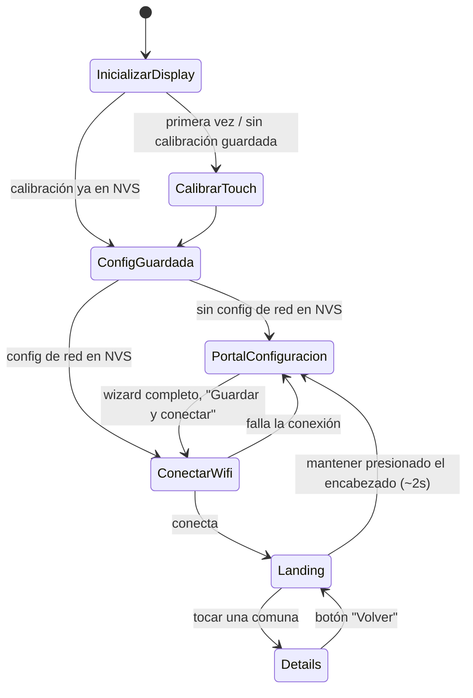

# Firmware — Kiosko ESP32

Cliente HTTP embebido que replica, en una pantalla táctil física, el flujo esencial del mapa web: una lista de las 22 comunas de Cali con su estado actual, y el detalle de la comuna elegida. Pensado como punto de consulta público que no depende de un navegador ni de una app instalada — solo de electricidad y WiFi.

## Qué hace

El kiosko muestra dos pantallas de contenido, más una de configuración inicial:

1. **Landing.** Al arrancar (o al volver de Details), pide `GET /sectors`, calcula en el propio dispositivo el PM2.5 promedio de la ciudad y el conteo de comunas por estado, y lista las 22 comunas en una lista con scroll, cada fila con un color según su estado.
2. **Details.** Al tocar una comuna: `GET /sectors/{id}` (indicadores actuales — PM2.5, CO2, humedad — y un gráfico de la evolución de las últimas 24 horas) y `GET /risk/{sector}` (promedio anual, peor mes, mejor mes, días sobre el límite diario de la OMS), en dos pestañas. No hay pestaña de sensores individuales: es una decisión de alcance deliberada — el kiosko muestra el mismo nivel de detalle que el mapa web, no el desglose por sensor.
3. **Configuración.** Wizard táctil de tres pasos (red WiFi, contraseña, URL del backend) que se completa una sola vez por dispositivo y persiste en memoria no volátil. Mantener presionado el encabezado de la Landing durante unos dos segundos vuelve a este portal, para reconfigurar sin reflashear.

El kiosko consume un subconjunto del contrato del backend: solo `GET /sectors`, `GET /sectors/{id}` y `GET /risk/{sector}`. No usa `GET /sectors/{id}/sensores`, `GET /education` ni `POST /chatbot` — no hay pantallas de contenido educativo ni de chatbot en este dispositivo.

## Hardware

Placa **ESP32-2432S028R** ("Cheap Yellow Display"), variante con controlador de panel **ST7789** (identificable por tener puerto USB-C además de Micro-USB; la otra variante del mismo modelo de placa, con un único Micro-USB, usa un controlador ILI9341 distinto).

| Componente | Especificación | Relevancia para el diseño |
| --- | --- | --- |
| MCU | ESP32-WROOM-32, dual-core 240 MHz | Suficiente para LVGL + HTTP + JSON sin ajustes especiales |
| SRAM | 520 KB, sin PSRAM | Restricción dura: obliga a filtrar y transmitir en streaming la respuesta de `/sectors` en vez de cargarla completa en memoria |
| Pantalla | ST7789, 320×240, bus SPI dedicado (SPI2/HSPI) | `LovyanGFX` como driver |
| Touch | XPT2046 resistivo, bus SPI propio (SPI3/VSPI), sin compartir con la pantalla | Requiere calibración de 4 puntos por unidad, persistida en memoria no volátil |
| Flash | 4 MB SPI | Con un esquema de particiones sin slots de actualización remota (OTA) duplicados, para dejarle espacio suficiente a LVGL + LovyanGFX + WiFi + ArduinoJson |
| Backlight | PWM sobre GPIO propio | Se apaga durante el fetch inicial de `/sectors` para reducir picos de consumo en ese tramo |
| Persistencia | NVS (partición flash) vía `Preferences.h` | Guarda configuración de red, URL del backend y calibración de touch entre reinicios |

## Arquitectura del firmware

```
Firmware/esp32-kiosko/
├── esp32-kiosko.ino      # setup()/loop(): inicializa display+LVGL, calibra touch, decide pantalla inicial
├── LGFX_Config.h         # configuración de LovyanGFX: pines, panel, bus SPI, touch
├── lv_conf.h             # configuración de LVGL v8
├── net_client.cpp/.h     # cliente HTTP: fetch filtrado de /sectors, fetch simple de /sectors/{id} y /risk/{sector}
├── storage_prefs.cpp/.h  # wrapper de NVS: config de red + calibración de touch
├── ui_config.cpp/.h      # pantalla de configuración (wizard de 3 pasos)
├── ui_landing.cpp/.h     # pantalla Landing (lista de comunas)
├── ui_details.cpp/.h     # pantalla Details (2 pestañas: Resumen + Historia)
└── partitions.csv        # esquema de particiones de flash (una sola app, sin OTA duplicado)
```

Todos los `.cpp`/`.h` están sueltos junto al `.ino`, sin subcarpetas: el toolchain de Arduino solo compila automáticamente los archivos directos de la carpeta del sketch. La separación por dominio se expresa con el prefijo del nombre de archivo (`ui_*`, `net_*`, `storage_*`), no con carpetas.

Stack: **Arduino IDE** como toolchain, **LVGL v8** para la interfaz (`lv_list`, `lv_tabview`, `lv_chart`, `lv_dropdown`, `lv_keyboard`), **LovyanGFX** como driver de pantalla y touch, **ArduinoJson v7** para parseo.



## Protocolo de comunicación con el backend

El kiosko habla HTTPS con el backend expuesto vía Tailscale Funnel (ver `backend.md` §Exposición en producción): el ESP32 no puede unirse a la tailnet (no existe cliente Tailscale para Arduino/ESP32), así que accede por la URL pública de Funnel como cualquier cliente HTTPS normal, sin necesidad de estar en la misma red.

Dos patrones de fetch distintos, según el tamaño del payload:

- **`GET /sectors` (streaming filtrado).** La respuesta completa (con el campo `geometry` de cada comuna incluido, que el kiosko no dibuja) pesa varios cientos de KB — muy por encima de la SRAM disponible. El firmware usa el filtro de deserialización de ArduinoJson (`DeserializationOption::Filter`) para descartar `geometry`, y parsea en streaming directo desde el socket TLS en vez de volcar la respuesta completa a un `String` primero. Esto evita que el pico de memoria incluya el JSON sin filtrar, pero no reduce el tráfico de red: el dispositivo igual debe **recibir** el payload completo antes de descartar ese campo durante el parseo.
- **`GET /sectors/{id}` y `GET /risk/{sector}` (simple).** Payloads pequeños (unos pocos KB y menos de 1 KB respectivamente), así que se resuelven con un `getString()` + `deserializeJson()` directo, sin streaming ni filtro.

La conexión usa `WiFiClientSecure`. Actualmente valida el certificado del servidor con `setInsecure()` (salta la validación de la cadena de certificados) — aceptable durante desarrollo, pero es un punto pendiente antes de un despliegue de producción del kiosko: reemplazar por `setCACert()` fijando el certificado raíz correspondiente (ver `backlog.md`).

## Manejo de energía y conectividad

- **Potencia de transmisión WiFi reducida** (`WiFi.setTxPower()`, al mínimo que expone el core de Arduino-ESP32) durante el escaneo de redes, la conexión y sus reintentos — para reducir los picos de corriente de las ráfagas de radio en el tramo donde se observó mayor inestabilidad en hardware real.
- **Backlight apagado durante el fetch inicial** de `/sectors` en la Landing, restaurado antes de mostrar el contenido — reduce el consumo combinado de WiFi + pantalla mientras no hay nada que mostrar de todas formas.
- **Reconexión WiFi limpia.** Antes de reintentar `WiFi.begin()` tras una conexión fallida, se llama `WiFi.disconnect(true, true)` para garantizar que el driver no arrastre un intento anterior a medio terminar.
- **Calibración de touch persistida por dispositivo.** La rutina de calibración de 4 puntos (touch resistivo, no capacitivo: cada unidad puede tener ligeras variaciones) corre una sola vez y su resultado se guarda en NVS; en arranques siguientes se restaura sin volver a pedírsela al usuario.

## Credenciales y configuración (`secrets.h`)

El repositorio versiona `secrets.h.example` como plantilla. Antes de compilar, se copia a `secrets.h` (no versionado, excluido en `.gitignore`) en la misma carpeta que el `.ino`:

```cpp
inline constexpr const char* kWifiSsid = "TU_RED_WIFI";
inline constexpr const char* kWifiPassword = "TU_PASSWORD";
inline constexpr const char* kBackendBaseUrl = "https://tu-maquina.tu-tailnet.ts.net";
```

| Constante | Propósito | Notas |
| --- | --- | --- |
| `kWifiSsid` / `kWifiPassword` | Plantilla de credenciales WiFi | No se usan para conectar en el flujo real: la red se elige y se prueba desde el wizard táctil en pantalla, y la conexión efectiva queda persistida en NVS. Se puede dejar cualquier valor; el archivo debe existir igual para que el proyecto compile |
| `kBackendBaseUrl` | URL pública del backend (dominio de Tailscale Funnel, HTTPS, sin puerto) | Se usa para precargar el campo de URL del paso 3 del wizard, así no hay que escribirla a mano en cada prueba — sigue siendo editable en pantalla, y el valor efectivo también queda persistido en NVS, no en este archivo |

`secrets.h` sigue siendo obligatorio para compilar (el wizard táctil lo incluye para la precarga descrita arriba), aunque la configuración de red y la URL del backend que el dispositivo usa en producción vengan siempre de lo que el usuario cargue por pantalla y quede guardado en NVS.

## Cómo flashear el firmware

Arduino IDE 2.x:

1. **Board Manager:** instalar el core "esp32 by Espressif Systems".
2. **Tools → Board:** `ESP32 Dev Module` (el ESP32-2432S028 usa un ESP32-WROOM-32 estándar).
3. **Tools → Partition Scheme:** `Custom` — el sketch trae su propio `partitions.csv` (una sola partición de aplicación de 3 MB, sin slots de actualización remota duplicados), pero el IDE solo lo usa si el menú está en `Custom`.
4. **Library Manager**, instalar:
   - `ArduinoJson` (Benoit Blanchon), versión 7.x.
   - `lvgl` (kisvegabor), versión 8.x.
   - `LovyanGFX` (lovyan03).
5. Abrir la carpeta `Firmware/esp32-kiosko/` en el IDE — debe cargar `esp32-kiosko.ino` como sketch principal, con el resto de archivos como pestañas del mismo sketch. `lv_conf.h` ya está versionado en esta misma carpeta; no requiere copiarse a ninguna ubicación global.
6. `cp secrets.h.example secrets.h` y completar al menos `kBackendBaseUrl` con la URL de Tailscale Funnel del backend.
7. Backend corriendo y Funnel activo (ver `backend.md`).
8. Conectar el ESP32-2432S028 por USB, seleccionar el puerto en **Tools → Port**, y subir (▶ Upload).
9. Abrir **Tools → Serial Monitor** a 115200 baudios. En el primer arranque (sin configuración guardada) corre la calibración de touch de 4 puntos y luego muestra el portal de configuración: elegir red, escribir contraseña, escribir la URL del backend, y "Guardar y conectar" — si conecta, persiste la configuración y reinicia hacia la Landing.

Si se reemplaza la unidad por una variante ILI9341 del mismo modelo de placa (un solo puerto Micro-USB), hay que revertir la configuración de panel en `LGFX_Config.h` (`Panel_ST7789` → `Panel_ILI9341`, junto con `freq_write`, `dummy_read_bits` y el `offset_rotation` del touch).
